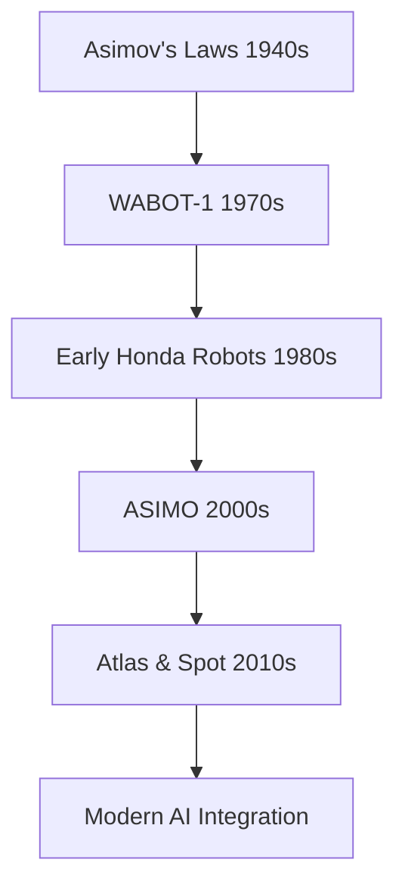
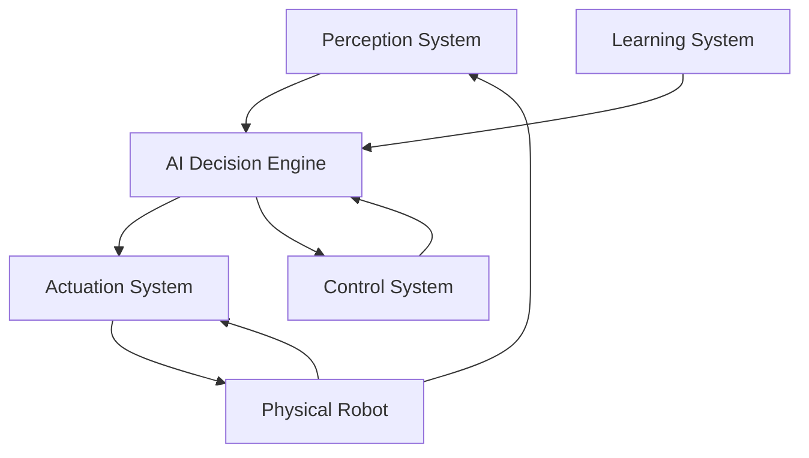

import Tabs from '@theme/Tabs';
import TabItem from '@theme/TabItem';

# Chapter 1: Introduction to Physical AI

## Learning Objectives
- Understand the concept of Physical AI and embodied intelligence
- Differentiate between digital AI and physical AI systems
- Identify key components of humanoid robotics systems
- Set up basic development environment for Physical AI

## 1.1 The Evolution from Digital to Physical AI

### Digital AI Limitations
```python
# Traditional AI operates in digital space
class DigitalAI:
    def process_data(self, input_data):
        # Processes information but has no physical embodiment
        return prediction

# Physical AI bridges to real world
class PhysicalAI(DigitalAI):
    def execute_action(self, prediction):
        # Converts digital decisions to physical actions
        actuator.execute(prediction)
```

:::note
Physical AI represents a paradigm shift from traditional artificial intelligence that operates primarily in digital domains to AI systems that interact with and operate within the physical world. Unlike classical AI that processes information in abstract computational spaces, Physical AI must contend with real-time constraints, uncertainty in sensing and actuation, and complex dynamics of physical systems.
:::

### The Embodiment Principle

The embodiment principle suggests that intelligence emerges from the interaction between an agent and its physical environment. For humanoid robots, this means:

- Physical form influences cognitive processes
- Sensorimotor experiences shape understanding
- Environmental constraints drive adaptive behaviors
- Morphological computation contributes to intelligent behavior

## 1.2 Historical Context: From Asimov to Boston Dynamics

The journey of humanoid robotics has been remarkable, evolving from science fiction to reality:

| Era | Key Developments | Notable Examples |
|-----|------------------|------------------|
| 1940s-1950s | Science Fiction Foundations | Isaac Asimov's Three Laws of Robotics |
| 1960s-1970s | Early Mechanical Prototypes | WABOT-1 (Waseda University) |
| 1980s-1990s | Improved Actuation & Control | Honda's E series |
| 2000s-2010s | Advanced Humanoid Platforms | ASIMO, QRIO, NAO |
| 2010s-Present | AI Integration & Real-World Deployment | Atlas, Spot, Sophia |



## 1.3 Components of Physical AI System

A complete Physical AI system consists of several interconnected components:



## 1.4 Setting up Python Environment

To work with Physical AI systems, you'll need to set up a proper development environment:

```bash
# Create virtual environment
python -m venv physical_ai_env

# Activate virtual environment
source physical_ai_env/bin/activate  # On Linux/Mac
# or
physical_ai_env\Scripts\activate     # On Windows

# Install essential packages
pip install numpy scipy matplotlib
pip install rclpy  # For ROS2 integration
pip install pybullet  # For physics simulation
```

## 1.5 Basic ROS2 Node Example

```python
#!/usr/bin/env python3
# Basic ROS2 node for Physical AI system
import rclpy
from rclpy.node import Node
from std_msgs.msg import String

class PhysicalAIBasicNode(Node):
    def __init__(self):
        super().__init__('physical_ai_basic_node')
        self.publisher_ = self.create_publisher(String, 'physical_ai_topic', 10)
        timer_period = 0.5  # seconds
        self.timer = self.create_timer(timer_period, self.timer_callback)
        self.i = 0

    def timer_callback(self):
        msg = String()
        msg.data = f'Physical AI message: {self.i}' % self.i
        self.publisher_.publish(msg)
        self.get_logger().info(f'Publishing: "{msg.data}"')
        self.i += 1

def main(args=None):
    rclpy.init(args=args)
    physical_ai_basic_node = PhysicalAIBasicNode()
    rclpy.spin(physical_ai_basic_node)
    physical_ai_basic_node.destroy_node()
    rclpy.shutdown()

if __name__ == '__main__':
    main()
```

## Exercise: Compare Two Humanoid Robots

Compare and contrast two different humanoid robots focusing on their design philosophy, capabilities, and applications:

1. **Honda ASIMO** vs **Boston Dynamics Atlas**
   - Locomotion approach and capabilities
   - Control systems and AI integration
   - Target applications and environments
   - Physical dimensions and specifications

Consider the following comparison criteria:
- Height and weight
- Degrees of freedom
- Locomotion speed and capabilities
- Sensing systems
- Target use cases

## Interactive Quiz

<Tabs>
  <TabItem value="question1" label="Physical vs Digital AI" default>
    What is the main difference between Physical AI and Digital AI?
    <details>
      <summary>Answer</summary>
      Physical AI operates in and interacts with the physical world, dealing with real-time constraints, uncertainty in sensing and actuation, and complex dynamics of physical systems. Digital AI operates primarily in digital domains processing information in abstract computational spaces.
    </details>
  </TabItem>

  <TabItem value="question2" label="Embodiment Principle">
    What does the embodiment principle suggest?
    <details>
      <summary>Answer</summary>
      The embodiment principle suggests that intelligence emerges from the interaction between an agent and its physical environment. For humanoid robots, this means physical form influences cognitive processes, sensorimotor experiences shape understanding, environmental constraints drive adaptive behaviors, and morphological computation contributes to intelligent behavior.
    </details>
  </TabItem>

  <TabItem value="question3" label="Humanoid Design">
    Why do humanoid robots adopt human-like forms?
    <details>
      <summary>Answer</summary>
      Humanoid robots adopt human-like forms for several reasons: environmental compatibility (human-designed environments), social interaction (facilitates natural human-robot interaction), research insights (provides insights into human cognition and movement), and functional versatility (enables broad task capabilities).
    </details>
  </TabItem>
</Tabs>

## Summary and Key Takeaways

This chapter introduced the fundamental concepts of Physical AI and humanoid robotics. We explored:

- The distinction between traditional digital AI and Physical AI
- The importance of embodiment in intelligent systems
- Historical evolution from science fiction to real-world implementations
- Key components of Physical AI systems
- Basic setup for Physical AI development

## References and Further Reading

1. Pfeifer, R., & Bongard, J. (2006). How the Body Shapes the Way We Think: A New View of Intelligence.
2. Cheng, F., et al. (2018). Humanoid Robotics: A Reference.
3. Khatib, O., & Park, H. (2017). Robot and Human Interactive Communication.
4. Asimov, I. (1950). I, Robot.
5. Brooks, R. (1991). Intelligence without representation.